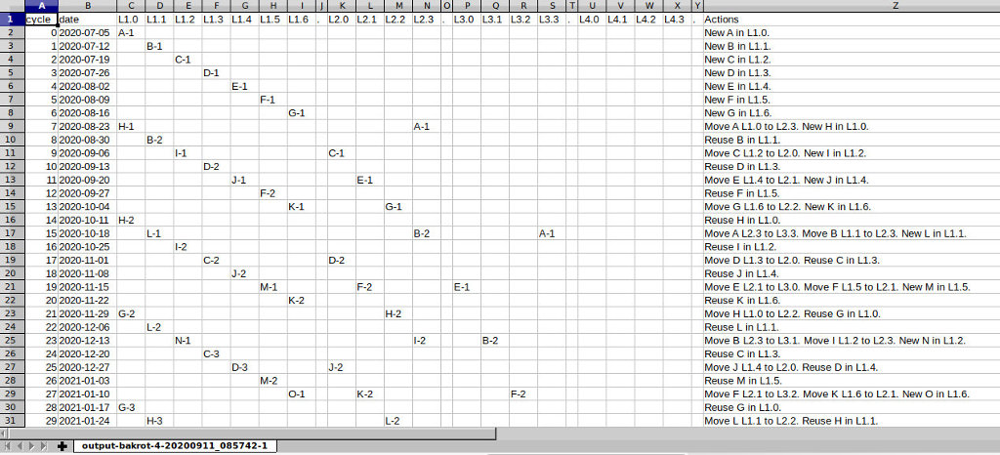
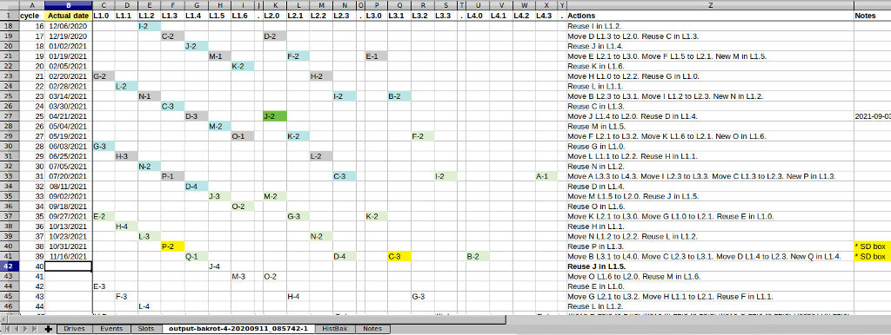
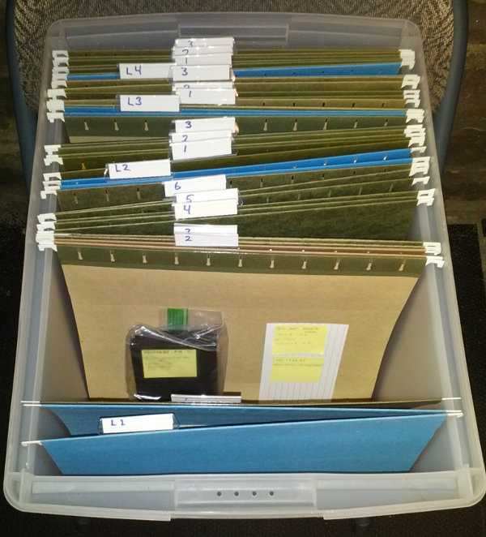

# Backup Rotation Plan Generator

## Purpose

This command-line tool, written in Python, calculates a plan for rotating backup media with different levels of retention.

It was built with two purposes in mind:
- Explore different schemes for rotating my personal backup media.
- Gain experience programming in Python.

This is a one-off utility program. It is **not a finished product.** Initially the parameters for different backup schemes were hard-coded. Later, those parameters were moved to JSON files, selected by passing the file name on the command line.

The primary output is a set of *.csv* files. I used *LibreOffice Calc* to view the files and compare different backup rotation schemes.

## Command-Line Arguments

Help text:
```
usage: bakplan.py [-h] [--debug-level DEBUG_LEVEL] scheme_file

Calculates a backup media rotation plan given a rotation scheme.

positional arguments:
  scheme_file           Path to the JSON file that defines the backup rotation
                        scheme.

optional arguments:
  -h, --help            show this help message and exit
  --debug-level DEBUG_LEVEL
                        Write extra debug information. Level: 0=none, 1=all.
                        Default is 0.
```

## Scheme File Example

```json
{
    "rotation_scheme": {
        "name": "Test1",
        "startdate": "2021-01-01",
        "cycles": "12",
        "period": "weeks",
        "levels": [
            {"level": 1, "slots": 2, "interval": 1},
            {"level": 2, "slots": 2, "interval": 2},
            {"level": 3, "slots": 2, "interval": 4}
        ]
    }
}
```

## Actual Use

I did settle on a scheme to use, and copied the rotation plan from the main output file (`bakrot-*-1.csv`) to a spreadsheet where I track the actual backups. 

BTW: The script was originally named "bakrot.py" - short for "backup rotation." I came to realize that name sounded like a nasty medical condition, so I changed the name to "bakplan.py." Of course, the old name persists in the history.

This is a screenshot of the generated CSV file open in LibreOffice Calc:



My initial plan was to rotate a set of external hard drives at a *weekly* backup interval, and keep a given number of backups at different (increasingly longer) retention intervals. In practice, I have not always done the backups weekly. That renders the *dates* in the original output obsolete beyond the initial assessment of the scheme. The important output is the *rotation plan*, which may be followed regardless of the original schedule.

This is a screenshot of the spreadsheet used to track the backups:



I update this spreadsheet each time I finish a backup rotation by entering the *Actual Date* of the backup. I also set cell colors to help me keep track of which entries are current (green = current, light blue = moved, gray = overwritten) or off-site (safe-deposit box).

This is a picture of the file box I use to store the external hard drives used for the backups:



The labels match the Level names in the spreadsheet header (the *L1* file holds level *L1.0*, and so on). For drives that are off-site there will still be an index card noting the location of the drive.
